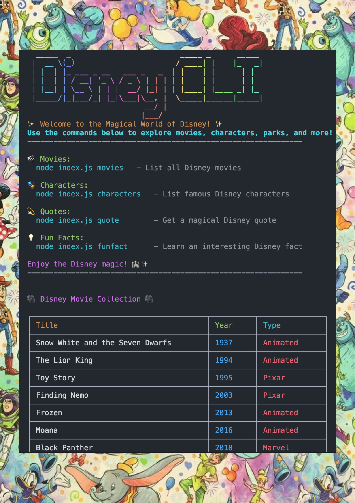

<div align="center">
  <h1>Disney CLI</h1>
</div>




## What it's about

The **Disney CLI** is a command-line app made using Node.js and JavaScript modules. It allows you to explore Disney movies, famous characters, quotes, and fun facts—all from your terminal!

## How to Run this

Code
🚀 Installation & Running the CLI

Clone the Repository

```bash
  git clone https://github.com/your-username/disney-cli.git
  cd disney-cli

```
Install Dependencies

```bash
  npm install

```

Run the CLI

```bash
  node index.js

```

Use a Command
Try running a command, such as listing Disney movies:

```bash
 node index.js movies


```


## Usage

Now that you have installed the app, you can run **disney-cli** in your terminal or cmd to explore the magical world of Disney! 🎬✨

### **🎞️ List all Disney movies**
```bash
  node index.js movies
```

### **🧑‍🎤 List famous Disney characters**
```bash
  node index.js characters
```

### **🗨️ Get a magical Disney quote**
```bash
 node index.js quote
```

### **💡 Learn a fun Disney fact**
```bash
  node index.js funfact
```

For example:
```bash
  node index.js The Lion King
```

This will fetch data about "The Lion King," including its release year, characters, and fun facts!


### Some Useful Notes
This CLI app is currently in development and is maintained by [me](https://github.com/yourusername). Development may be slow due to other commitments, but new features will continue to be added!


Enjoy the Disney magic! ✨🎥
